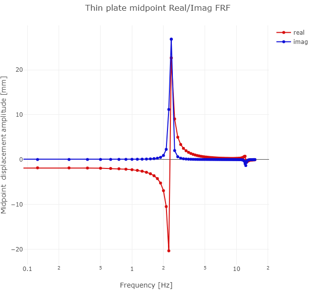

# TEST 13H: square plate under harmonic loading

## Description

Harmonic forced vibration problem is solved for a homogeneous square plate,
simply-supported on the circumference. This is the TEST 13H from the Abaqus v
6.12 Benchmarks manual. The test is recommended by the National Agency for
Finite Element Methods and Standards (U.K.): Test 13 from NAFEMS “Selected
Benchmarks for Forced Vibration,” R0016, March 1993.

The plate is discretized with hexahedral solid elements. The simple support
condition is approximated by distributed rollers on the boundary. Because
only the out of plane displacements are prevented, the structure has three
rigid body modes in the plane of the plate.

Homogeneous square plate, simply-supported on the circumference from the test
13 from NAFEMS “Selected Benchmarks for Forced Vibration,” R0016, March 1993.
The nonzero benchmark frequencies are (in hertz): 2.377, 5.961, 5.961, 9.483,
12.133, 12.133, 15.468, 15.468 [Hz].



## References

[1] NAFEMS “Selected Benchmarks for Forced Vibration,” R0016, March 1993.

## Goals

- Show how to generate hexahedral mesh, mirroring and merging together parts.
- Execute transient simulation by the trapezoidal-rule time stepping of [1].

```julia
#
```

## Definitions

Bring in required support.

```julia
using FinEtools
using FinEtoolsDeforLinear
using LinearAlgebra
using Arpack
```

The input parameters come from [1].

```julia
E = 200*phun("GPa");# Young's modulus
nu = 0.3;# Poisson ratio
rho = 8000*phun("kg*m^-3");# mass density
qmagn = 100.0*phun("Pa")
L = 10.0*phun("m"); # side of the square plate
t = 0.05*phun("m"); # thickness of the square plate
nL = 16; nt = 4;
tolerance = t/nt/100;
frequencies = vcat(linearspace(0.0,2.377,20), linearspace(2.377,15.0,70))
```

Compute the parameters of Rayleigh damping. For the two selected
frequencies we have the relationship between the damping ratio and
the Rayleigh parameters

$\xi_m=a_0/\omega_m+a_1\omega_m$
where $m=1,2$.  Solving for the Rayleigh parameters $a_0,a_1$ yields:

```julia
zeta1 = 0.02; zeta2 = 0.02;
o1 = 2*pi*2.377;  o2 = 2*pi*15.468;
a0 = 2*(o1*o2)/(o2^2-o1^2)*(o2*zeta1-o1*zeta2);# a0
a1 = 2*(o1*o2)/(o2^2-o1^2)*(-1/o2*zeta1+1/o1*zeta2);# a1

#
```

## Discrete model

Generate the finite element domain as a block.

```julia
fens,fes  = H8block(L, L, t, nL, nL, nt)
```

Create the geometry field.

```julia
geom = NodalField(fens.xyz)
```

Create the displacement field. Note that it holds complex numbers.

```julia
u = NodalField(zeros(FCplxFlt, size(fens.xyz,1), 3)) # displacement field
```

In order to apply the essential boundary conditions we need to select the
nodes along the side faces of the plate and support them in the Z direction.

```julia
nl = selectnode(fens, box=[0.0 0.0 -Inf Inf -Inf Inf], inflate=tolerance)
setebc!(u, nl, true, 3)
nl = selectnode(fens, box=[L L -Inf Inf -Inf Inf], inflate=tolerance)
setebc!(u, nl, true, 3)
nl = selectnode(fens, box=[-Inf Inf 0.0 0.0 -Inf Inf], inflate=tolerance)
setebc!(u, nl, true, 3)
nl = selectnode(fens, box=[-Inf Inf L L -Inf Inf], inflate=tolerance)
setebc!(u, nl, true, 3)
```

Those boundary conditions can now be applied to the displacement field,...

```julia
applyebc!(u)
```

... and the degrees of freedom can be numbered.

```julia
numberdofs!(u)
println("nfreedofs = $(u.nfreedofs)")
```

The model is three-dimensional.

```julia
MR = DeforModelRed3D
material = MatDeforElastIso(MR, rho, E, nu, 0.0)
```

Given how relatively thin the plate is we choose an effective element: the
mean-strain hexahedral element which is quite tolerant of the high aspect
ratio.

```julia
femm = FEMMDeforLinearMSH8(MR, IntegDomain(fes, GaussRule(3,2)), material)
```

These elements require  to know the geometry before anything else can be
computed using them in a finite element machine. Hence we first need to
associate the geometry with the FEMM.

```julia
femm = associategeometry!(femm, geom)
```

Now we can calculate the stiffness matrix and the mass matrix: both evaluated
with the high-order Gauss rule.

```julia
K = stiffness(femm, geom, u)
femm = FEMMDeforLinear(MR, IntegDomain(fes, GaussRule(3,3)), material)
M = mass(femm, geom, u)
```

The damping matrix is a linear combination of the mass matrix and the
stiffness matrix (Rayleigh model).

```julia
C = a0*M + a1*K
```

Find the boundary finite elements on top of the plate. The uniform distributed
loading will be applied to these elements.

```julia
bdryfes = meshboundary(fes)
```

Those facing up (in the positive Z direction) will be chosen:

```julia
topbfl = selectelem(fens, bdryfes, facing=true, direction=[0.0 0.0 1.0])
```

A base finite element model machine will be created to evaluate the loading.
The force intensity is created as driven by a function, but the function
really only just fills the buffer with the constant loading vector.

```julia
function pfun(forceout::FVec{T}, XYZ::FFltMat, tangents::FFltMat, fe_label::FInt) where {T}
    forceout .=  [0.0, 0.0, -qmagn]
    return forceout
end
fi = ForceIntensity(FFlt, 3, pfun);
```

The loading vector is lumped from the distributed uniform loading by
integrating on the boundary. Hence, the dimension of the integration domain
is 2.

```julia
el1femm =  FEMMBase(IntegDomain(subset(bdryfes,topbfl), GaussRule(2,2)))
F = distribloads(el1femm, geom, u, fi, 2);

#
```

## Sweep through the frequencies

Sweep through the frequencies and calculate the complex displacement vector
for each  of the frequencies from the complex balance equations of the
structure.

The entire solution will be stored  in this array:

```julia
U1 = zeros(FCplxFlt, u.nfreedofs, length(frequencies))

print("Sweeping through $(length(frequencies)) frequencies\n")
for k in 1:length(frequencies)
    frequency = frequencies[k];
    omega = 2*pi*frequency;
    U1[:, k] = (-omega^2*M + 1im*omega*C + K)\F;
    print(".")
end
print("\n")
```

Find the midpoint of the plate bottom surface.  For this purpose the number of
elements along the edge of the plate needs to be divisible by two.

```julia
midpoint = selectnode(fens, box=[L/2 L/2 L/2 L/2 0 0], inflate=tolerance);
```

Check that we found that node.

```julia
@assert midpoint != []
```

Extract the displacement component in the vertical direction (Z).

```julia
midpointdof = u.dofnums[midpoint, 3]

#
```

## Plotting the results

```julia
using PlotlyJS

options = Dict(
        :showSendToCloud=>true,
        :plotlyServerURL=>"https://chart-studio.plotly.com"
        )
```

Plot the amplitude of the FRF.

```julia
umidAmpl = abs.(U1[midpointdof, :])/phun("MM")
```

Define the layout of the figure.

```julia
layout = Layout(;width=650, height=600, xaxis=attr(title="Frequency [Hz]", type = "log"), yaxis=attr(title="Midpoint  displacement amplitude [mm]", type = "linear"), title = "Thin plate midpoint Amplitude FRF")
```

Create the graphs:

```julia
plots = cat(scatter(;x=vec(frequencies), y=vec(umidAmpl), mode="lines", name = "FEA", line_color = "rgb(215, 15, 15)"); dims = 1)
```

Plot the graphs:

```julia
pl = plot(plots, layout; options)
display(pl)
```

Plot the FRF real and imaginary components.

```julia
umidReal = real.(U1[midpointdof, :])/phun("MM")
umidImag = imag.(U1[midpointdof, :])/phun("MM")
```

Define the layout of the figure.

```julia
layout = Layout(;width=650, height=600, xaxis=attr(title="Frequency [Hz]", type = "log"), yaxis=attr(title="Midpoint  displacement amplitude [mm]", type = "linear"), title = "Thin plate midpoint Real/Imag FRF")
```

Create the graphs:

```julia
plots = cat(scatter(;x=vec(frequencies), y=vec(umidReal), mode="markers+lines", name = "real", line_color = "rgb(215, 15, 15)"), scatter(;x=vec(frequencies), y=vec(umidImag), mode="markers+lines", name = "imag", line_color = "rgb(15, 15, 215)"); dims = 1)
```

Plot the graphs:

```julia
pl = plot(plots, layout; options)
display(pl)
```

Plot the shift of the FRF.

```julia
umidPhase = atan.(umidImag, umidReal)/pi*180
```

Define the layout of the figure.

```julia
layout = Layout(;width=650, height=600, xaxis=attr(title="Frequency [Hz]", type = "log"), yaxis=attr(title="Phase shift [deg]", type = "linear"), title = "Thin plate midpoint FRF phase")
```

Create the graphs:

```julia
plots = cat(scatter(;x=vec(frequencies), y=vec(umidPhase), mode="lines", name = "phase", line_color = "rgb(15, 215, 15)"),; dims = 1)
```

Plot the graphs:

```julia
pl = plot(plots, layout; options)
display(pl)

true
```

---

*This page was generated using [Literate.jl](https://github.com/fredrikekre/Literate.jl).*

