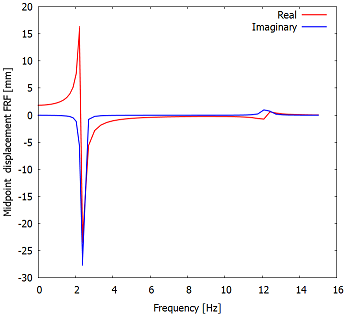

# TEST 13H: square plate under harmonic loading. Parallel execution.

Source code: [`TEST13H_par_tut.jl`](TEST13H_par_tut.jl)

## Description

Harmonic forced vibration problem is solved for a homogeneous square plate,
simply-supported on the circumference. This is the TEST 13H from the Abaqus v
6.12 Benchmarks manual. The test is recommended by the National Agency for
Finite Element Methods and Standards (U.K.): Test 13 from NAFEMS “Selected
Benchmarks for Forced Vibration,” R0016, March 1993.

The plate is discretized with hexahedral solid elements. The simple support
condition is approximated by distributed rollers on the boundary. Because
only the out of plane displacements are prevented, the structure has three
rigid body modes in the plane of the plate.

Homogeneous square plate, simply-supported on the circumference from the test
13 from NAFEMS “Selected Benchmarks for Forced Vibration,” R0016, March 1993.
The nonzero benchmark frequencies are (in hertz): 2.377, 5.961, 5.961, 9.483,
12.133, 12.133, 15.468, 15.468 [Hz].

The magnitude of the displacement for the fundamental frequency (2.377 Hz) is
45.42mm according to the reference solution.



The harmonic response loop is processed with multiple threads. The algorithm
is embarrassingly parallel (i. e. no communication is required). Hence the
parallel execution is particularly simple.

## References

[1] NAFEMS “Selected Benchmarks for Forced Vibration,” R0016, March 1993.

## Goals

- Show how to generate hexahedral mesh, mirroring and merging together parts.
- Execute transient simulation by the trapezoidal-rule time stepping of [1].

````julia
#
````

## Definitions

Bring in required support.

````julia
using FinEtools
using FinEtools.AlgoBaseModule: matrix_blocked, vector_blocked
using FinEtoolsDeforLinear
using LinearAlgebra
using Arpack
````

The input parameters come from [1].

````julia
E = 200*phun("GPa");# Young's modulus
nu = 0.3;# Poisson ratio
rho = 8000*phun("kg*m^-3");# mass density
qmagn = 100.0*phun("Pa")
L = 10.0*phun("m"); # side of the square plate
t = 0.05*phun("m"); # thickness of the square plate
nL = 16; nt = 4;
tolerance = t/nt/100;
frequencies = vcat(linearspace(0.0,2.377,15), linearspace(2.377,15.0,40))
````

Compute the parameters of Rayleigh damping. For the two selected
frequencies we have the relationship between the damping ratio and
the Rayleigh parameters

$\xi_m=a_0/\omega_m+a_1\omega_m$
where $m=1,2$.  Solving for the Rayleigh parameters $a_0,a_1$ yields:

````julia
zeta1 = 0.02; zeta2 = 0.02;
o1 = 2*pi*2.377;  o2 = 2*pi*15.468;
a0 = 2*(o1*o2)/(o2^2-o1^2)*(o2*zeta1-o1*zeta2);# a0
a1 = 2*(o1*o2)/(o2^2-o1^2)*(-1/o2*zeta1+1/o1*zeta2);# a1

#
````

## Discrete model

Generate the finite element domain as a block.

````julia
fens,fes  = H8block(L, L, t, nL, nL, nt)
````

Create the geometry field.

````julia
geom = NodalField(fens.xyz)
````

Create the displacement field. Note that it holds complex numbers.

````julia
u = NodalField(zeros(ComplexF64, size(fens.xyz,1), 3)) # displacement field
````

In order to apply the essential boundary conditions we need to select the
nodes along the side faces of the plate and support them in the Z direction.

````julia
nl = selectnode(fens, box=[0.0 0.0 -Inf Inf -Inf Inf], inflate=tolerance)
setebc!(u, nl, true, 3)
nl = selectnode(fens, box=[L L -Inf Inf -Inf Inf], inflate=tolerance)
setebc!(u, nl, true, 3)
nl = selectnode(fens, box=[-Inf Inf 0.0 0.0 -Inf Inf], inflate=tolerance)
setebc!(u, nl, true, 3)
nl = selectnode(fens, box=[-Inf Inf L L -Inf Inf], inflate=tolerance)
setebc!(u, nl, true, 3)
````

Those boundary conditions can now be applied to the displacement field,...

````julia
applyebc!(u)
````

... and the degrees of freedom can be numbered.

````julia
numberdofs!(u)
println("nfreedofs = $(nfreedofs(u))")
````

The model is three-dimensional.

````julia
MR = DeforModelRed3D
material = MatDeforElastIso(MR, rho, E, nu, 0.0)
````

Given how relatively thin the plate is we choose an effective element: the
mean-strain hexahedral element which is quite tolerant of the high aspect
ratio.

````julia
femm = FEMMDeforLinearMSH8(MR, IntegDomain(fes, GaussRule(3,2)), material)
````

These elements require  to know the geometry before anything else can be
computed using them in a finite element machine. Hence we first need to
associate the geometry with the FEMM.

````julia
femm = associategeometry!(femm, geom)
````

Now we can calculate the stiffness matrix and the mass matrix: both evaluated
with the high-order Gauss rule.

````julia
K = stiffness(femm, geom, u)
femm = FEMMDeforLinear(MR, IntegDomain(fes, GaussRule(3,3)), material)
M = mass(femm, geom, u)
````

The damping matrix is a linear combination of the mass matrix and the
stiffness matrix (Rayleigh model).

````julia
C = a0*M + a1*K
````

Extract the free-free block of the matrices.

````julia
M_ff = matrix_blocked(M, nfreedofs(u))[:ff]
K_ff = matrix_blocked(K, nfreedofs(u))[:ff]
C_ff = matrix_blocked(C, nfreedofs(u))[:ff]
````

Find the boundary finite elements on top of the plate. The uniform distributed
loading will be applied to these elements.

````julia
bdryfes = meshboundary(fes)
````

Those facing up (in the positive Z direction) will be chosen:

````julia
topbfl = selectelem(fens, bdryfes, facing=true, direction=[0.0 0.0 1.0])
````

A base finite element model machine will be created to evaluate the loading.
The force intensity is created as driven by a function, but the function
really only just fills the buffer with the constant loading vector.

````julia
function pfun(forceout::Vector{T}, XYZ, tangents, feid, qpid) where {T}
    forceout .=  [0.0, 0.0, qmagn]
    return forceout
end
fi = ForceIntensity(Float64, 3, pfun);
````

The loading vector is lumped from the distributed uniform loading by
integrating on the boundary. Hence, the dimension of the integration domain
is 2.

````julia
el1femm =  FEMMBase(IntegDomain(subset(bdryfes,topbfl), GaussRule(2,2)))
F = distribloads(el1femm, geom, u, fi, 2);
F_f = vector_blocked(F, nfreedofs(u))[:f]

#
````

## Sweep through the frequencies

Sweep through the frequencies and calculate the complex displacement vector
for each  of the frequencies from the complex balance equations of the
structure.

The entire solution will be stored  in this array:

````julia
U1 = zeros(ComplexF64, nfreedofs(u), length(frequencies))
````

It is best to prevent the BLAS library from using threads concurrently with
our own use of threads. The threads might easily become oversubscribed, with
attendant slowdown.

````julia
LinearAlgebra.BLAS.set_num_threads(1)
````

We utilize all the threads with which Julia was started. We can select the
number of threads to use by running the executable as `julia -t n`, where `n`
is the number of threads.

````julia
using Base.Threads
print("Number of threads: $(nthreads())\n")
print("Sweeping through $(length(frequencies)) frequencies\n")
t0 = time()
Threads.@threads for k in 1:length(frequencies)
    f = frequencies[k];
    omega = 2*pi*f;
    U1[:, k] = (-omega^2*M_ff + 1im*omega*C_ff + K_ff)\F_f;
    print(".")
end
print("\nTime = $(time()-t0)\n")
````

On Windows the scaling is not great, which is not Julia's fault, but rather
the operating system's failing. Linux usually gives much greater speedups.

Find the midpoint of the plate bottom surface.  For this purpose the number of
elements along the edge of the plate needs to be divisible by two.

````julia
midpoint = selectnode(fens, box=[L/2 L/2 L/2 L/2 0 0], inflate=tolerance);
````

Check that we found that node.

````julia
@assert midpoint != []
````

Extract the displacement component in the vertical direction (Z).

````julia
midpointdof = u.dofnums[midpoint, 3]

#
````

## Plot the results

````julia
using Gnuplot
````

Plot the amplitude of the FRF.

````julia
umidAmpl = abs.(U1[midpointdof, :])/phun("MM")
@gp "set terminal windows 0 " :-
@gp  :- vec(frequencies) vec(umidAmpl) "lw 2 lc rgb 'red' with lines title 'Displacement of the corner' " :-
@gp  :- "set xlabel 'Frequency [Hz]'" :-
@gp  :- "set ylabel 'Midpoint  displacement amplitude [mm]'"
````

Plot the FRF real and imaginary components.

````julia
umidReal = real.(U1[midpointdof, :])/phun("MM")
umidImag = imag.(U1[midpointdof, :])/phun("MM")
@gp  "set terminal windows 1 "  :-
@gp  :- vec(frequencies) vec(umidReal) "lw 2 lc rgb 'red' with lines title 'Real' "  :-
@gp  :- vec(frequencies) vec(umidImag) "lw 2 lc rgb 'blue' with lines title 'Imaginary' "  :-
@gp  :- "set xlabel 'Frequency [Hz]'" :-
@gp  :- "set ylabel 'Midpoint  displacement FRF [mm]'"
````

# Plot the shift of the FRF.

````julia
umidPhase = atan.(umidImag, umidReal)/pi*180
@gp  "set terminal windows 2 "  :-
@gp  :- vec(frequencies) vec(umidPhase) "lw 2 lc rgb 'red' with lines title 'Phase shift' "  :-
@gp  :- "set xlabel 'Frequency [Hz]'" :-
@gp  :- "set ylabel 'Phase shift [deg]'"


true
````

---

*This page was generated using [Literate.jl](https://github.com/fredrikekre/Literate.jl).*

