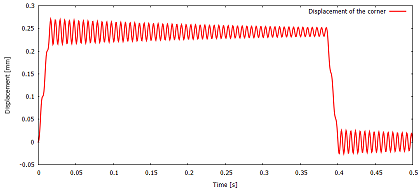

# Beam under on/off loading: transient response

Source code: [`beam_load_on_off_tut.jl`](beam_load_on_off_tut.jl)

## Description

A cantilever beam is loaded by a trapezoidal-pulse traction load at its free
cross-section. The load is applied within 0.015 seconds and taken off after
0.37 seconds. The beam oscillates about its equilibrium configuration.

The beam is modeled as a solid. Trapezoidal rule is used to integrate the
equations of motion in time. Rayleigh mass- and stiffness-proportional
damping is incorporated. The dynamic stiffness is factorized for efficiency.



## Goals

- Show how to create the discrete model, with implicit dynamics and proportional damping.
- Apply distributed loading varying in time.
- Demonstrate  trapezoidal-rule time stepping.

````julia
#
````

## Definitions

Basic imports.

````julia
using LinearAlgebra
using Arpack
````

This is the finite element toolkit itself.

````julia
using FinEtools
using FinEtools.AlgoBaseModule: matrix_blocked, vector_blocked
````

The linear stress analysis application is implemented in this package.

````julia
using FinEtoolsDeforLinear
using FinEtoolsDeforLinear.AlgoDeforLinearModule
````

Input parameters

````julia
E = 205000*phun("MPa");# Young's modulus
nu = 0.3;# Poisson ratio
rho = 7850*phun("KG*M^-3");# mass density
loss_tangent = 0.005;
L = 200*phun("mm");
W = 4*phun("mm");
H = 8*phun("mm");
tolerance = W/500;
qmagn = 0.1*phun("MPa");
tend = 0.5*phun("SEC");


#
````

## Create the discrete model

````julia
MR = DeforModelRed3D
fens,fes  = H8block(L, W, H, 50, 2, 4)

geom = NodalField(fens.xyz)
u = NodalField(zeros(size(fens.xyz,1),3)) # displacement field

nl = selectnode(fens, box=[L L -Inf Inf -Inf Inf], inflate=tolerance)
setebc!(u, nl, true, 1)
setebc!(u, nl, true, 2)
setebc!(u, nl, true, 3)
applyebc!(u)
numberdofs!(u)

corner = selectnode(fens, nearestto=[0 0 0])
cornerzdof = u.dofnums[corner[1], 3]

material = MatDeforElastIso(MR, rho, E, nu, 0.0)

femm = FEMMDeforLinearMSH8(MR, IntegDomain(fes, GaussRule(3,2)), material)
femm = associategeometry!(femm, geom)
K = stiffness(femm, geom, u)
femm = FEMMDeforLinear(MR, IntegDomain(fes, GaussRule(3,3)), material)
M = mass(femm, geom, u)
````

Extract the free-free block of the matrices.

````julia
M_ff = matrix_blocked(M, nfreedofs(u))[:ff]
K_ff = matrix_blocked(K, nfreedofs(u))[:ff]
````

Find the boundary finite elements at the tip cross-section of the beam. The
uniform distributed loading will be applied to these elements.

````julia
bdryfes = meshboundary(fes)
````

Those facing in the positive X direction will be chosen:

````julia
tipbfl = selectelem(fens, bdryfes, facing=true, direction=[-1.0 0.0 0.0])
````

A base finite element model machine will be created to evaluate the loading.
The force intensity is created as driven by a function, but the function
really only just fills the buffer with the constant loading vector.

````julia
function pfun(forceout::Vector{T}, XYZ, tangents, feid, qpid) where {T}
    forceout .=  [0.0, 0.0, qmagn]
    return forceout
end
fi = ForceIntensity(Float64, 3, pfun);
````

The loading vector is lumped from the distributed uniform loading by
integrating on the boundary. Hence, the dimension of the integration domain
is 2.

````julia
el1femm =  FEMMBase(IntegDomain(subset(bdryfes,tipbfl), GaussRule(2,2)))
F = distribloads(el1femm, geom, u, fi, 2);
F_f, F_d = vector_blocked(F, nfreedofs(u))[(:f, :d)]
````

The loading function is defined as a time -dependent multiplier of the
constant distribution of the loading on the structure.

````julia
function tmult(t)
    if (t <= 0.015)
        t/0.015
    else
        if (t >= 0.4)
            0.0
        else
            if (t <= 0.385)
                1.0
            else
                (t - 0.4)/(0.385 - 0.4)
            end
        end
    end
end


#
````

## Time step determination

We figure out the fundamental mode frequency, which will determine the time
step is a fraction of the period.

````julia
evals, evecs = eigs(K_ff, M_ff; nev=1, which=:SM);
````

The fundamental angular frequency is then:

````julia
omega_f = real(sqrt(evals[1]));
````

We take  the time step to be a fraction of the period of vibration  in the
fundamental mode.

````julia
@show dt = 0.05 * 1/(omega_f/2/pi);


#
````

## Damping model

We take the damping to be representative of what's happening at the
fundamental vibration frequency.

For a given loss factor at a certain  frequency $\omega_f$, the
stiffness-proportional damping coefficient may be estimated as
2*loss_tangent/$\omega_f$, and the mass-proportional damping coefficient may be
estimated as 2*loss_tangent*$\omega_f$.

````julia
Rayleigh_mass = (loss_tangent/2)*omega_f;
Rayleigh_stiffness = (loss_tangent/2)/omega_f;
````

Now we construct the Rayleigh damping matrix as a linear combination of the
stiffness and mass matrices.

````julia
C_ff = Rayleigh_stiffness * K_ff + Rayleigh_mass * M_ff
````

The time stepping loop is protected by `let end` to avoid unpleasant surprises
with variables getting clobbered by globals.

````julia
ts, corneruzs = let dt = dt, F_f = F_f
````

Initial displacement, velocity, and acceleration.

````julia
    U0 = gathersysvec(u)
    v = deepcopy(u)
    V0 = gathersysvec(v)
    U1 = fill(0.0, length(V0))
    V1 = fill(0.0, length(V0))
    F0 = deepcopy(F_f)
    F1 = fill(0.0, length(F0))
    R  = fill(0.0, length(F0))
````

Factorize the dynamic stiffness

````julia
    DSF = cholesky((M_ff + (dt/2)*C_ff + ((dt/2)^2)*K_ff))
````

The times and displacements of the corner will be collected into two vectors

````julia
    ts = Float64[]
    corneruzs = Float64[]
````

Let us begin the time integration loop:

````julia
    t = 0.0;
    step = 0;
    F0 .= tmult(t) .* F_f
    while t < tend
        push!(ts, t)
        push!(corneruzs, U0[cornerzdof])
        t = t+dt;
        step = step + 1;
        (mod(step,100)==0) && println("Step $(step): $(t)")
````

Set the time-dependent load

````julia
        F1 .= tmult(t) .* F_f
````

Compute the out of balance force.

````julia
        R .= (M_ff*V0 - C_ff*(dt/2*V0) - K_ff*((dt/2)^2*V0 + dt*U0) + (dt/2)*(F0+F1));
````

Calculate the new velocities.

````julia
        V1 = DSF\R;
````

Update the velocities.

````julia
        U1 = U0 + (dt/2)*(V0+V1);
````

Switch the temporary vectors for the next step.

````julia
        U0, U1 = U1, U0;
        V0, V1 = V1, V0;
        F0, F1 = F1, F0;
        if (t == tend) # Are we done yet?
            break;
        end
        if (t+dt > tend) # Adjust the last time step so that we exactly reach tend
            dt = tend-t;
        end
    end
    ts, corneruzs # return the collected results
end

#
````

## Plot the results

````julia
using Gnuplot

@gp "set terminal windows 0 " :-
@gp  :- ts corneruzs./phun("mm") "lw 2 lc rgb 'red' with lines title 'Displacement of the corner' "
@gp  :- "set xlabel 'Time [s]'"
@gp  :- "set ylabel 'Displacement [mm]'"
````

The end.

````julia
true
````

---

*This page was generated using [Literate.jl](https://github.com/fredrikekre/Literate.jl).*

