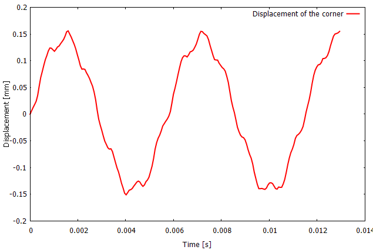

# Tracking transient deformation of a cantilever beam

Source code: [`bending_wave_Ray_tut.jl`](bending_wave_Ray_tut.jl)

## Description

A cantilever beam is given an initial velocity and then at time 0.0 it is
suddenly stopped by fixing one of its ends. This sends a wave down the beam.

The beam is modeled as a solid. Consistent mass matrix is used.
Trapezoidal rule is used to integrate the
equations of motion in time. Rayleigh mass-proportional damping is
incorporated. The dynamic stiffness is factorized for efficiency.

Deflection at the free end will look like this:


## Goals

- Show how to create the discrete model.
- Demonstrate  trapezoidal-rule time stepping.

````julia
#
````

## Definitions

Basic imports.

````julia
using LinearAlgebra
using Arpack
````

This is the finite element toolkit itself.

````julia
using FinEtools
using FinEtools.AlgoBaseModule: matrix_blocked, vector_blocked
````

The linear stress analysis application is implemented in this package.

````julia
using FinEtoolsDeforLinear
using FinEtoolsDeforLinear.AlgoDeforLinearModule
````

Input parameters

````julia
E = 205000*phun("MPa");# Young's modulus
nu = 0.3;# Poisson ratio
rho = 7850*phun("KG*M^-3");# mass density
loss_tangent = 0.0001;
frequency = 1/0.0058;
Rayleigh_mass = 2*loss_tangent*(2*pi*frequency);
L = 200*phun("mm");
W = 4*phun("mm");
H = 8*phun("mm");
tolerance = W/500;
vmag = 0.1*phun("m")/phun("SEC");
tend = 0.013*phun("SEC");

#
````

## Create the discrete model

````julia
MR = DeforModelRed3D
fens,fes  = H8block(L,W,H, 50,1,4)

geom = NodalField(fens.xyz)
u = NodalField(zeros(size(fens.xyz,1),3)) # displacement field

nl = selectnode(fens, box=[L L -Inf Inf -Inf Inf], inflate=tolerance)
setebc!(u, nl, true, 1)
setebc!(u, nl, true, 2)
setebc!(u, nl, true, 3)
applyebc!(u)
numberdofs!(u)

corner = selectnode(fens, nearestto=[0 0 0])
cornerzdof = u.dofnums[corner[1], 3]

material = MatDeforElastIso(MR, rho, E, nu, 0.0)

femm = FEMMDeforLinear(MR, IntegDomain(fes, GaussRule(3,2)), material)
femm = associategeometry!(femm, geom)
K = stiffness(femm, geom, u)
femm = FEMMDeforLinear(MR, IntegDomain(fes, GaussRule(3,3)), material)
M = mass(femm, geom, u)
````

Extract the free-free block of the matrices.

````julia
M_ff = matrix_blocked(M, nfreedofs(u))[:ff]
K_ff = matrix_blocked(K, nfreedofs(u))[:ff]
````

Find the relationship of the sum of all the elements of the
mass matrix and the total mass of the structure.

````julia
@show sum(sum(M_ff))
@show L*W*H*rho
````

Form the damping matrix.

````julia
C_ff = Rayleigh_mass * M_ff
````

Figure out the highest frequency in the model, and use a time step that is
considerably larger than the period of that highest frequency.

````julia
evals, evecs = eigs(K_ff, M_ff; nev=1, which=:LM);
@show dt = 350 * 2/real(sqrt(evals[1]));
````

The time stepping loop is protected by `let end` to avoid unpleasant surprises
with variables getting clobbered by globals.

````julia
ts, corneruzs = let dt = dt
````

Initial displacement, velocity, and acceleration.

````julia
    U0 = gathersysvec(u)
    v = deepcopy(u)
    v.values[:, 3] .= vmag
    V0 = gathersysvec(v)
    F0 = fill(0.0, length(V0))
    U1 = fill(0.0, length(V0))
    V1 = fill(0.0, length(V0))
    F1 = fill(0.0, length(V0))
    R  = fill(0.0, length(V0))
````

Factorize the dynamic stiffness

````julia
    DSF = cholesky((M_ff + (dt/2)*C_ff + ((dt/2)^2)*K_ff))
````

The times and displacements of the corner will be collected into two vectors

````julia
    ts = Float64[]
    corneruzs = Float64[]
````

Let us begin the time integration loop:

````julia
    t = 0.0;
    step = 0;
    while t < tend
        push!(ts, t)
        push!(corneruzs, U0[cornerzdof])
        t = t+dt;
        step = step + 1;
        (mod(step,25)==0) && println("Step $(step): $(t)")
````

Zero out the load

````julia
        fill!(F1, 0.0);
````

Compute the out of balance force.

````julia
        R = (M_ff*V0 - C_ff*(dt/2*V0) - K_ff*((dt/2)^2*V0 + dt*U0) + (dt/2)*(F0+F1));
````

Calculate the new velocities.

````julia
        V1 = DSF\R;
````

Update the velocities.

````julia
        U1 = U0 + (dt/2)*(V0+V1);
````

Switch the temporary vectors for the next step.

````julia
        U0, U1 = U1, U0;
        V0, V1 = V1, V0;
        F0, F1 = F1, F0;
        if (t == tend) # Are we done yet?
            break;
        end
        if (t+dt > tend) # Adjust the last time step so that we exactly reach tend
            dt = tend-t;
        end
    end
    ts, corneruzs # return the collected results
end

#
````

## Plot the results

````julia
using Gnuplot

@gp "set terminal windows 0 " :-
@gp  :- ts corneruzs./phun("mm") "lw 2 lc rgb 'red' with lines title 'Displacement of the corner' "
@gp  :- "set xlabel 'Time [s]'"
@gp  :- "set ylabel 'Displacement [mm]'"
````

The end.

````julia
true
````

---

*This page was generated using [Literate.jl](https://github.com/fredrikekre/Literate.jl).*

