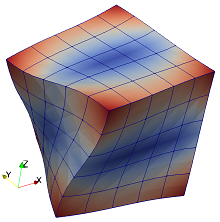

# Vibration of a cube of nearly incompressible material: alternative models

Source code: [`unit_cube_modes_alt_tut.jl`](unit_cube_modes_alt_tut.jl)

## Description

Compute the free-vibration spectrum of a unit cube of nearly
incompressible isotropic material, E = 1, ν = 0.499, and ρ = 1 (refer to [1]).

Here we show how alternative finite element models compare:
The solution with the serendipity quadratic hexahedron is supplemented with
solutions obtained with advanced finite elements: nodal-integration energy
stabilized hexahedra and tetrahedra, and mean-strain hexahedra and
tetrahedra.

## References

[1] Puso MA, Solberg J (2006) A stabilized nodally integrated tetrahedral. International Journal for Numerical Methods in Engineering 67: 841-867.
[2] P. Krysl, Mean-strain 8-node hexahedron with optimized energy-sampling
stabilization, Finite Elements in Analysis and Design 108 (2016) 41–53.



## Goals

- Show how to set up a simulation loop that will run all the models and collect data.
- Show how to present the computed spectrum curves.

````julia
#
````

## Definitions

This is the finite element toolkit itself.

````julia
using FinEtools
````

The linear stress analysis application is implemented in this package.

````julia
using FinEtoolsDeforLinear
````

Convenience import.

````julia
using FinEtools.MeshExportModule
````

The eigenvalue problem is solved with the Lanczos algorithm from this package.

````julia
using Arpack

using SymRCM
````

The material properties and dimensions are defined with physical units.

````julia
E = 1*phun("PA");
nu = 0.499;
rho = 1*phun("KG/M^3");
a = 1*phun("M"); # length of the side of the cube
N = 8
neigvs = 20 # how many eigenvalues
OmegaShift = (0.01*2*pi)^2; # The frequency with which to shift
````

The model is fully three-dimensional, and hence the material model  and the
FEMM created below need to refer to an appropriate model-reduction scheme.

````julia
MR = DeforModelRed3D
material = MatDeforElastIso(MR, rho, E, nu, 0.0);
````

````julia
models = [
    ("H20", H20block, GaussRule(3,2), FEMMDeforLinear, 1),
    ("ESNICEH8", H8block, NodalTensorProductRule(3), FEMMDeforLinearESNICEH8, 2),
    ("ESNICET4", T4block, NodalSimplexRule(3), FEMMDeforLinearESNICET4, 2),
    ("MSH8", H8block, NodalTensorProductRule(3), FEMMDeforLinearMSH8, 2),
    ("MST10", T10block, TetRule(4), FEMMDeforLinearMST10, 1),
]
````

Run  the simulation loop over all the models.

````julia
sigdig(n) = round(n * 10000) / 10000
results = let
    results = []
    for m in models
        fens, fes  = m[2](a, a, a, m[5]*N, m[5]*N, m[5]*N);
        @show count(fens)
        geom = NodalField(fens.xyz)
        u = NodalField(zeros(size(fens.xyz,1),3))
        numbering = let
            C = connectionmatrix(FEMMBase(IntegDomain(fes, m[3])), count(fens))
            numbering = symrcm(C)
        end
        numberdofs!(u, numbering);
        println("nfreedofs = $(nfreedofs(u))")

        femm = m[4](MR, IntegDomain(fes, m[3]), material);
        femm = associategeometry!(femm, geom)
        K = stiffness(femm, geom, u)
        M = mass(femm, geom, u);

        evals, evecs, nconv = eigs(K+OmegaShift*M, M; nev=neigvs, which=:SM)
        @show nconv == neigvs
        evals = evals .- OmegaShift;
        fs = real(sqrt.(complex(evals)))/(2*pi)
        println("$(m[1]) eigenvalues: $(sigdig.(fs)) [Hz]")
        push!(results, (m, fs))
    end
    results # return it
end

#
````

## Present the results graphically

````julia
using Gnuplot


@gp  "set terminal windows 0 "  :-
for r in results
    @gp  :- collect(1:length(r[2])) vec(r[2]) " lw 2 with lp title '$(r[1][1])' "  :-
end
@gp  :- "set xlabel 'Mode number [ND]'" :-
@gp  :- "set ylabel 'Frequency [Hz]'"
````

---

*This page was generated using [Literate.jl](https://github.com/fredrikekre/Literate.jl).*

